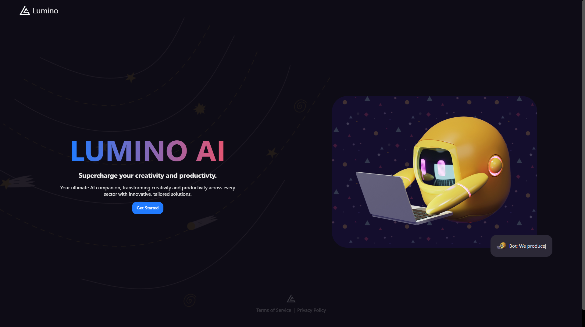

<div align="center">


# ✨ Lumino AI – Your Intelligent Productivity Companion ✨

> 🚀 Supercharge your productivity and creativity with real-time AI chat, code help, and image analysis

[](https://reactjs.org/)
[](https://vitejs.dev/)
[](https://firebase.google.com/)
[](https://deepmind.google/technologies/gemini/)
[](https://nodejs.org/)
[](https://expressjs.com/)
[](https://www.mongodb.com/)

[](https://github.com/SubhodeepSamanta/Lumino/stargazers)
[](https://github.com/SubhodeepSamanta/Lumino/network/members)
[](https://github.com/SubhodeepSamanta/Lumino/issues)

---

</div>

## ✨ Features

- 🔐 **Secure Firebase Authentication** (Email/Password, Google)
- 💬 **AI-Powered Chat** with Google Gemini for real-time, context-aware conversations
- 🖼️ **Image Upload & Analysis**: Get instant insights or creative help on your images
- 📝 **Code Assistant**: Get help, explanations, and code generation instantly
- 📊 **Personalized Dashboard** with recent chats, chat history, and quick actions
- 📁 **Cloud-based Chat History**: Access your conversations from any device
- 🚀 **Responsive UI**: Modern, accessible, and mobile-friendly
- 🌙 **Pro Upgrade**: Unlock unlimited features with Lumino AI Pro

## 🚀 Quick Start

### Prerequisites

- Node.js (v18+)
- npm (v9+)
- MongoDB URI
- Firebase project (for authentication)
- Google Gemini API key

### 1. Clone the Repository

```bash
git clone https://github.com/SubhodeepSamanta/Lumino.git
cd Lumino
```

### 2. Backend Setup

```bash
cd Backend
npm install

# Create a .env file and add:
PORT=5000
MONGO_URI=your_mongodb_uri
CLIENT_URL=http://localhost:5173
FIREBASE_*=(your firebase secrets)
IMAGEKIT_*=(your imagekit keys, if using imagekit)
GOOGLE_GEMINI_API_KEY=your_gemini_api_key
```

### 3. Frontend Setup

```bash
cd ../Frontend
npm install

# Create a .env file and add:
VITE_URL_ENDPOINT=http://localhost:5000
VITE_GEMINI_API_KEY=your_gemini_api_key
```

### 4. Run the App

```bash
# In one terminal (Backend)
cd Backend
npm run dev

# In another terminal (Frontend)
cd ../Frontend
npm run dev
```

---

## 📁 Environment Variables

### Backend

| Variable                | Description                 | Example                                  |
|-------------------------|-----------------------------|------------------------------------------|
| `PORT`                  | Backend server port         | 5000                                     |
| `MONGO_URI`             | MongoDB connection string   | mongodb+srv://...                        |
| `CLIENT_URL`            | Frontend URL                | http://localhost:5173                    |
| `GOOGLE_GEMINI_API_KEY` | Google Gemini API key       | ...                                      |
| `FIREBASE_*`            | Firebase credentials        | Refer to Firebase docs                   |
| `IMAGEKIT_*`            | Imagekit credentials        | (Optional, for image uploads)            |

### Frontend

| Variable                | Description                 | Example                                  |
|-------------------------|-----------------------------|------------------------------------------|
| `VITE_URL_ENDPOINT`     | Backend API endpoint        | http://localhost:5000                    |
| `VITE_GEMINI_API_KEY`   | Google Gemini API key       | ...                                      |

---

## 🛠️ Tech Stack

### Frontend
- **React** + **Vite**
- **Firebase Auth**
- **Google Gemini AI**
- **Axios**
- **React Query**
- **Custom CSS**

### Backend
- **Node.js**
- **Express.js**
- **MongoDB**
- **Firebase Admin SDK**
- **ImageKit** (optional, for image uploads)
- **Google Gemini API**

---

## 🖼️ Screenshots

<div align="center">

| Home | Sign Up | Dashboard | Chat |
|------|--------|-----------|------|
|  |  |  |  |

</div>

---

## 💻 Development Scripts

| Command        | Description           |
|----------------|-----------------------|
| `npm run dev`  | Starts frontend/backend in dev mode |

---

## 🤝 Contributing

We welcome contributions!

1. Fork this repo
2. Create your feature branch (`git checkout -b feature/AmazingFeature`)
3. Commit your changes (`git commit -m 'Add some feature'`)
4. Push to the branch (`git push origin feature/AmazingFeature`)
5. Open a Pull Request

---

## 📝 License

This project is licensed under the MIT License. See the [LICENSE](LICENSE) file for details.

---

<div align="center">

Made with ❤️ by [SubhodeepSamanta](https://github.com/SubhodeepSamanta)

</div>